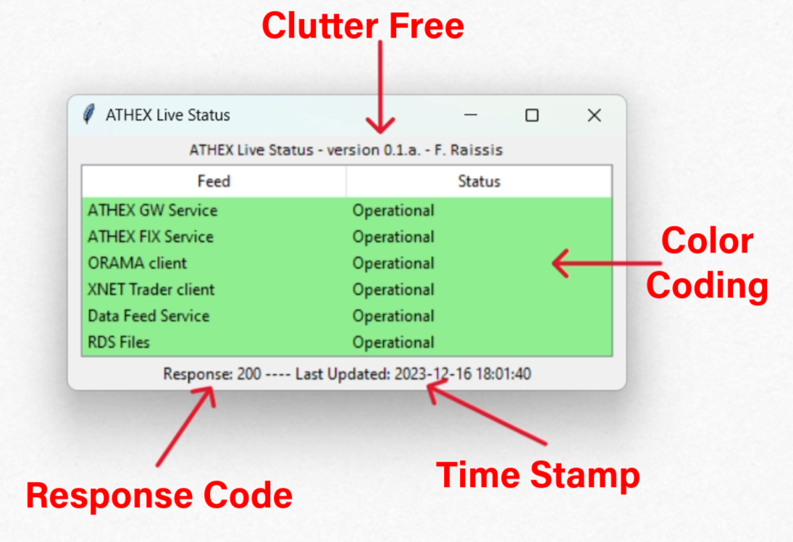

# ATHEX-STATUS

----------------

_Current Version: v0.1.a_ --- 16-12-2023

---------------------------

### Description

The ATHEX Live Status App gets and shows the current operational status of ATHEX services (such as trading connectivity
via GW/FIX and data/RDS) as posted on this (https://status.athexgroup.gr/components.json) webpage in JSON format.

This App offer a convenient desktop view for traders to remain updated in real-time on the ATHEX status without involving
push notifications via RSS-API apps e.g. MS Teams or Slack. 

**Supported Services Status**
* ATHEX GW
* ATHEX FIX
* ORAMA CLIENT
* XNET CLIENT
* Data Feed Service
* RDS Files

**Update Frequency**: It has a refresh period of 1.5 seconds (0.75Hz).

_All Rights Reserved, Fivos Raissis, Fjall Investment Research, 2023._
